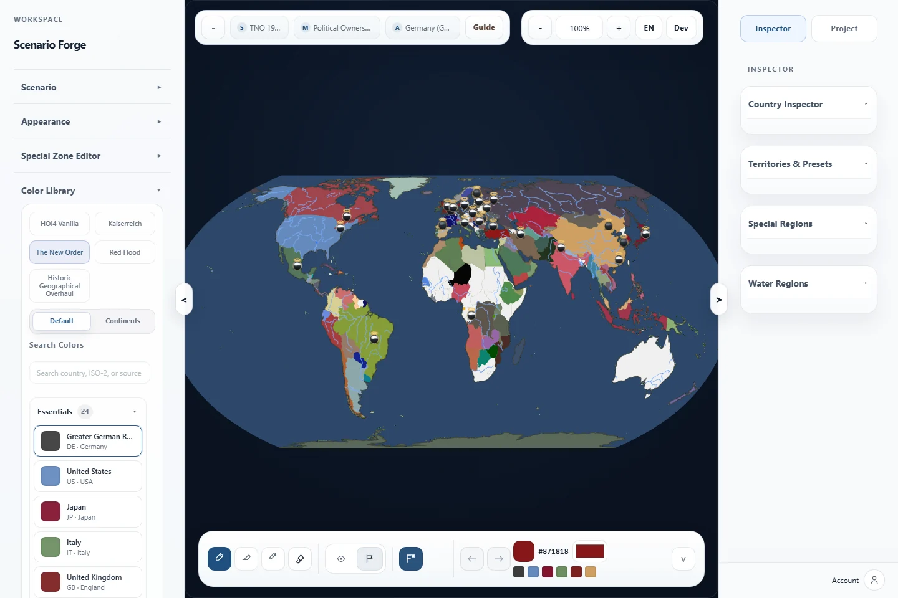
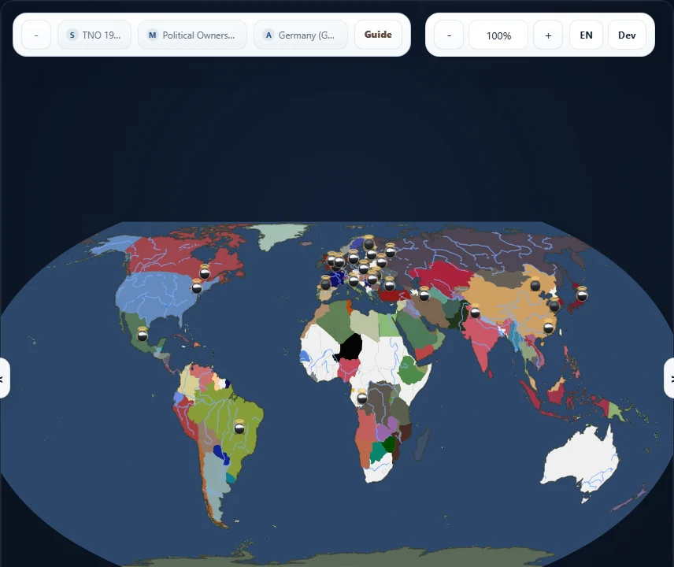
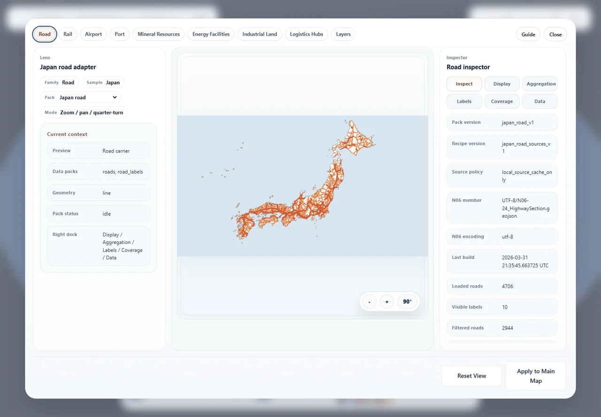
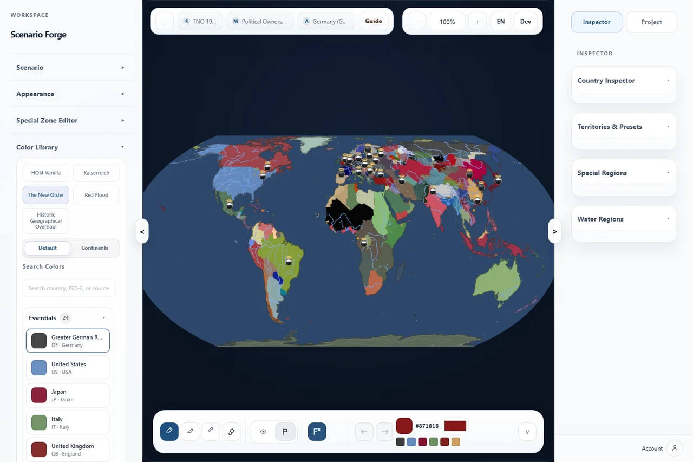
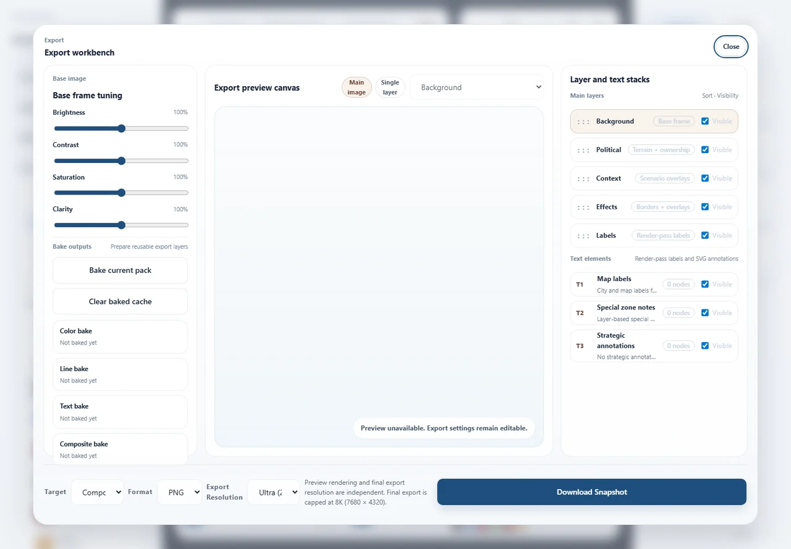

<div align="center">
  

  <h1>Scenario Forge</h1>

  Scenario Forge 是一个以世界场景为核心的地图创作工作台，适合架空历史、策略游戏 Mod、地缘政治叙事和地图展示。
  打开公开 Demo 就能进入编辑器，按引导从 TNO 1962 开始，最后导出 PNG/JPG 截图或可编辑项目文件。HGO 1936 属于开发/本地预览，Cloud Saves 和社区系统属于本地后端预览。

  <p>
    <a href="./LICENSE"></a>
    <a href="https://raederhans.github.io/scenario-forge/"></a>
    <a href="https://github.com/raederhans/scenario-forge/actions/workflows/deploy.yml"></a>
    <a href="https://github.com/raederhans/scenario-forge/issues"></a>
    <a href="./README.md"></a>
    <a href="./README.zh-CN.md"></a>
  </p>

  <p>
    <a href="https://raederhans.github.io/scenario-forge/">在线体验</a>
    ·
    <a href="https://github.com/raederhans/scenario-forge/issues">反馈问题</a>
    ·
    <a href="./README.md">English</a>
  </p>

  
</div>

## 它能做什么

Scenario Forge 把场景选择、政治编辑、地图外观、战略标注、交通图层检查和导出流程放在同一个工作区里，让创作者可以从世界状态快速走到可展示的地图成品。

- **场景基线：** 从 Blank Map、Modern World、HOI4 1936、HOI4 1939 或 TNO 1962 开始创作。HGO 1936 作为开发/本地预览提供，并与 5 个公开基线分开展示。
- **政治编辑：** 重绘国家归属和实际控制，检查同一地区被多方控制的情况，并切换归属、控制、战线视图。
- **地图外观：** 调整海洋、边界、大区/父级边界、地形、城市范围、城市点、河流、纹理、昼夜效果和参考底图。
- **战略标注：** 添加图例、战线、作战线、作战图形、标签和兵棋单位标记。
- **交通工作台：** 检查公开面最成熟的道路与铁路图层，并通过总览或工作台预览查看机场、港口、矿产、能源设施、工业区、物流节点和图层顺序。
- **双语导出流程：** 使用英文或简体中文界面，保存可编辑项目文件，并导出 1x-4x 比例的 PNG/JPG 展示截图。

## 用 5 步跑通公开 Demo

1. 打开 [在线体验](https://raederhans.github.io/scenario-forge/)。
2. 从首页进入编辑器/Demo 工作区。
3. 也可以直接打开引导入口 [`/app/?view=guide`](https://raederhans.github.io/scenario-forge/app/?view=guide)。
4. 按默认公开路径使用 TNO 1962，或在 Blank Map、Modern World、HOI4 1936、HOI4 1939、TNO 1962 这 5 个公开基线之间切换。
5. 打开 Project / Export，下载 PNG/JPG 截图，或保存可继续编辑的项目 JSON。

## 打开或下载样例项目

首页已经为公开基线接入可打开和可下载的起步项目。使用 `/app/?sample=<sample-id>&view=guide` 可以直接打开带 sample-aware Guide 的编辑器，Guide 会标出当前可编辑示例，列出 5 个公开起步样例，显示推荐导出路径，并提供导出和原始 JSON 下载入口。在 Guide 内切换样例会复用已入库清单；如果当前作品有未保存编辑，会先弹出确认；切换成功后，URL 会更新为所选 `sample`。Project 标签页也会确认样例已加载，Export Workbench 会重复显示当前样例和推荐输出。对应项目 JSON 与推荐导出 metadata 记录在 [`landing/assets/sample-runs.json`](landing/assets/sample-runs.json) 里。

- TNO 1962 Atlantropa briefing：[在编辑器中打开](https://raederhans.github.io/scenario-forge/app/?sample=tno-1962-atlantropa-briefing&view=guide) · [`tno-1962-atlantropa-briefing.project.json`](landing/assets/sample-projects/tno-1962-atlantropa-briefing.project.json)
- HOI4 1936 Europe briefing：[在编辑器中打开](https://raederhans.github.io/scenario-forge/app/?sample=hoi4-1936-europe-briefing&view=guide) · [`hoi4-1936-europe-briefing.project.json`](landing/assets/sample-projects/hoi4-1936-europe-briefing.project.json)
- HOI4 1939 Europe switch：[在编辑器中打开](https://raederhans.github.io/scenario-forge/app/?sample=hoi4-1939-europe-switch&view=guide) · [`hoi4-1939-europe-switch.project.json`](landing/assets/sample-projects/hoi4-1939-europe-switch.project.json)
- Modern World Japan corridor：[在编辑器中打开](https://raederhans.github.io/scenario-forge/app/?sample=modern-world-japan-corridor&view=guide) · [`modern-world-japan-corridor.project.json`](landing/assets/sample-projects/modern-world-japan-corridor.project.json)
- Blank Map starter：[在编辑器中打开](https://raederhans.github.io/scenario-forge/app/?sample=blank-base-starter&view=guide) · [`blank-base-starter.project.json`](landing/assets/sample-projects/blank-base-starter.project.json)

## 当前公开能力边界

| 能力面 | 公开 Demo 状态 | 本地/开发边界 |
| --- | --- | --- |
| 公开场景基线 | 在线可用：Blank Map、Modern World、HOI4 1936、HOI4 1939、TNO 1962。 | HGO 1936 保持开发/本地预览身份，并与 5 个公开基线分开展示。 |
| HGO 运行预览 | 仅限开发/本地。 | 用于检查 HOI4 风格国家身份、配色库、旗帜和栅格渲染效果。 |
| 交通工作台 | 在线提供总览/工作台能力；道路和铁路是公开面最成熟的路径，机场和港口提供总览上下文。 | 矿产、能源、工业和物流继续作为预览/工作台数据族推进。 |
| 导出工作台 | 在线可用。 | 支持 1x-4x PNG/JPG 截图导出，也可以保存可编辑项目 JSON。 |
| Cloud Saves 和社区 | 本地后端预览。 | 运行 `start_backend_preview.bat` 后，可试用登录状态、Cloud Saves、帖子、下载、评论、举报和管理员审核。 |
| 数据溯源 | 基于真实来源并有记录。 | 详细记录在 `data/source_ledger.json`、`data/` 下的 `.provenance.json`、`data/transport_layers/` 下的交通配方，以及生成资产的来源记录中。 |

## 看它实际长什么样

<table>
  <tr>
    <td width="50%">
      <br>
      <strong>政治场景地图</strong><br>
      切换世界基线、查看边界，并在编辑时保持地图清晰。
    </td>
    <td width="50%">
      <br>
      <strong>交通工作台</strong><br>
      检查有来源记录的道路、铁路、机场、港口和其他规划图层。
    </td>
  </tr>
  <tr>
    <td width="50%">
      <br>
      <strong>适合展示的地图样式</strong><br>
      组合边界、地形、河流、城市灯光和纹理控制，做出更完整的地图效果。
    </td>
    <td width="50%">
      <br>
      <strong>分层导出控制</strong><br>
      调整图片效果、选择格式、排列图层，并准备最终截图。
    </td>
  </tr>
</table>

## 适合谁

- 需要快速制作政治地图的架空历史创作者。
- 正在探索世界设定的 HOI4、TNO、Kaiserreich 和 Red Flood Mod 作者。
- 准备地图概念图的场景与战役设计者。
- 需要清晰地图视觉材料的写作者、研究者和展示者。
- 希望在同一工作区完成保存、样式调整和导出的地图创作者。

## 开始使用

### 在线体验

打开在线版本：

- https://raederhans.github.io/scenario-forge/

在线版本适合体验场景编辑、外观调整、项目文件和导出流程。
想快速确认公开 Demo 能跑通时，按上面的 5 步路径操作即可。

### 本地编辑器

前置条件：

- 项目内置的 `.bat` 启动脚本面向 Windows。
- 本机需要能通过 `py -3` 或 `python` 运行 Python 3。
- 第一次启动会准备本地数据和运行文件，耗时会更长。

启动完整本地编辑器：

```bat
start_dev.bat
```

本地数据已经准备好后，可以更快启动：

```bat
start_dev.bat fast
```

用干净运行会话启动：

```bat
start_dev.bat fresh
```

### 本地后端预览

打开本地后端和社区预览：

```bat
start_backend_preview.bat
```

这个本地模式会把预览后端数据存到本机 `.runtime/backend/`。它适合试用 Cloud Saves、公开社区帖子、下载、评论、举报和管理员审核流程。

## 常见工作流

1. 选择一个场景基线。
2. 编辑国家归属、实际控制或战线状态。
3. 调整边界、水域、地形、城市、河流、交通和参考图等视觉图层。
4. 添加图例、作战线、兵棋单位标记、标签和作战图形等展示元素。
5. 保存可编辑项目 JSON，再导出最终 PNG/JPG 展示截图。

## 功能状态

主编辑路径已经可以用于常规地图创作：场景切换、政治编辑、外观控制、项目保存/载入、战略标注和导出。

一些较大的系统目前以预览能力呈现：

- **Cloud Saves 和社区：** 通过本地后端预览使用。
- **交通工作台：** 多个交通类别已接入真实来源数据和缓存数据。道路与铁路是公开面最成熟的主地图路径；机场和港口进入总览上下文；矿产、能源、工业和物流继续作为工作台/预览数据族推进。
- **HGO 运行预览：** 用于检查 HOI4 Mod 国家身份、配色库、旗帜和地图渲染效果的本地开发预览能力。

<details>
<summary><strong>完整能力矩阵</strong></summary>

| 功能面 | 你可以做什么 |
| --- | --- |
| 场景地图 | 从 Blank Map、Modern World、HOI4 1936、HOI4 1939 或 TNO 1962 开始创作。HGO 1936 作为开发/本地预览提供。 |
| 政治编辑 | 重绘国家归属和实际控制，检查同一地区被多方控制的情况，并在归属、控制、战线视图之间切换。 |
| 视觉风格 | 调整海洋、边界、大区/父级边界、地形、城市范围、城市点、河流、纹理、昼夜效果和参考底图。 |
| 战略展示 | 添加图例、战线、作战线、作战图形、标签和兵棋单位标记。 |
| 交通背景 | 通过交通工作台检查公开面最成熟的道路与铁路图层，并通过总览或工作台预览查看机场、港口、矿产、能源设施、工业区、物流节点和图层顺序。 |
| 导出流程 | 导出 1x-4x 比例的 PNG/JPG 展示截图，调整亮度/对比度/饱和度，并管理图层顺序。 |
| 项目文件 | 保存可编辑项目 JSON，记录场景、外观、交通、战略标注、参考图对齐值和导出设置。 |
| 社区预览 | 在本地后端模式中试用登录状态、Cloud Saves、发布、社区下载、评论、举报和管理审核工具。 |
| Mod 预览 | 在本地开发预览模式中，用 HGO 运行预览和配色库工具检查 HOI4 风格国家身份、旗帜、颜色和渲染效果。 |
| 多语言 | 使用英文或简体中文界面。 |

</details>

<details>
<summary><strong>数据来源与溯源</strong></summary>

Scenario Forge 结合公开地理数据、参考数据和项目整理出来的资产。主要来源包括：

| 来源 | 用途 |
| --- | --- |
| [Natural Earth](https://www.naturalearthdata.com/) | 基础地理、国家、海岸线和小比例尺参考图层。 |
| [geoBoundaries](https://www.geoboundaries.org/) | 行政边界参考数据。 |
| [GeoNames](https://www.geonames.org/) | 地名、城市和地点参考数据。 |
| [NOAA ETOPO 2022](https://www.ncei.noaa.gov/products/etopo-global-relief-model) | 全球地形、海底地形和地貌背景。 |
| [NASA Black Marble](https://blackmarble.gsfc.nasa.gov/) | 夜间灯光和城市灯光纹理背景。 |
| [OpenStreetMap](https://www.openstreetmap.org/) | 道路、铁路、设施和其他交通/背景要素。 |
| [Geofabrik](https://download.geofabrik.de/) | 用于交通工作台的区域 OpenStreetMap 数据摘录。 |
| [日本 MLIT 道路数据（N06）](https://nlftp.mlit.go.jp/ksj/) | 日本道路校准和交通预览参考数据。 |

详细来源记录在 `data/source_ledger.json`、`data/` 目录下的 `.provenance.json`、`data/transport_layers/` 下的交通数据来源配方，以及生成资产的来源记录中。

</details>

## 项目信息

项目代码和文档采用 **MIT 许可证**。第三方数据和整理后的资产保留各自原始来源条款与来源记录。

当前维护者：**[@raederhans](https://github.com/raederhans)**。

如果你发现功能异常、显示问题或体验不一致，可以在 GitHub 上提交问题：

- https://github.com/raederhans/scenario-forge/issues
